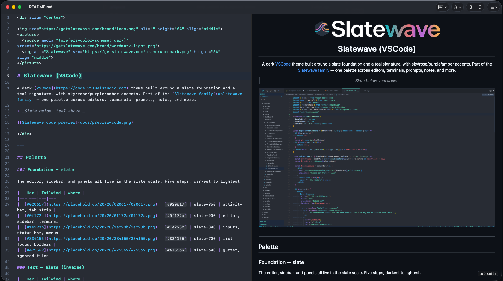

<div align="center">


<picture>
  <source media="(prefers-color-scheme: dark)" srcset="https://getslatewave.com/brand/wordmark-light.png">
  
</picture>

# Slatewave (MarkEdit)

A Slatewave theme for [MarkEdit](https://github.com/MarkEdit-app/MarkEdit) — the native macOS markdown editor. Part of the [Slatewave family](#slatewave-family) — one palette across editors, terminals, prompts, notes, and more.

> _Slate below, teal above._



</div>

---

## What it styles

Built on top of [MarkEdit-theming](https://github.com/MarkEdit-app/MarkEdit-theming), the Slatewave theme tunes MarkEdit's editor chrome and markdown syntax without depending on any upstream CodeMirror theme. It ships both dark and light variants.

- **Headings** — teal `#5eead4`
- **Bold / italic** — sky `#38bdf8` for bold, purple `#b388ff` for italic
- **Links** — sky `#38bdf8`
- **Inline code & fenced blocks** — pale-teal identifiers, sky keywords, teal strings, rose numerics, amber macros/decorators
- **Comments / quotes** — slate `#64748b` / `#94a3b8`
- **Caret & selection** — teal `#5eead4` with a soft 25% tint behind selections
- **Active line** — subtle slate wash
- **Gutter** — muted slate, no border

---

## Installation

### Manual (recommended)

Download [`dist/markedit-theme-slatewave.js`](dist/markedit-theme-slatewave.js) and drop it into MarkEdit's scripts folder:

```sh
cp dist/markedit-theme-slatewave.js \
  ~/Library/Containers/app.cyan.markedit/Data/Documents/scripts/
```

Relaunch MarkEdit. The theme activates automatically and follows your system light/dark setting.

### Build from source

```sh
git clone https://github.com/kevinlangleyjr/markedit-slatewave
cd markedit-slatewave
yarn install
yarn build   # builds and auto-deploys into MarkEdit's scripts folder
yarn reload  # quits and relaunches MarkEdit
```

### Uninstall

```sh
yarn uninstall
```

---

## Settings

In MarkEdit's [`settings.json`](https://github.com/MarkEdit-app/MarkEdit/wiki/Customization#advanced-settings) you can scope the theme to a single mode:

```json
{
  "extension.markeditThemeSlatewave": {
    "enabledMode": "both"
  }
}
```

- `enabledMode`: `both` (default), `light`, `dark`, or `none` to disable.

---

## Palette

Slatewave shares its palette with the companion VSCode, Obsidian, and oh-my-posh themes.

| | Hex | Tailwind | Role |
|---|---|---|---|
|  | `#282c34` | — | editor background |
|  | `#1e293b` | slate-800 | active line, fold placeholders |
|  | `#334155` | slate-700 | dividers, visible-space guides |
|  | `#64748b` | slate-500 | comments, gutter text |
|  | `#e2e8f0` | slate-200 | body text |
|  | `#5eead4` | teal-300 | **primary accent** — headings, caret, strings |
|  | `#99f6e4` | teal-200 | types, classes |
|  | `#7dd3fc` | sky-300 | labels |
|  | `#38bdf8` | sky-400 | bold, links, keywords |
|  | `#b388ff` | — | italic, meta, processing instructions |
|  | `#fb7185` | rose-400 | numbers, constants, atoms |
|  | `#fbbf24` | amber-400 | macros, regex, escapes |

Full scale and Tailwind names at [getslatewave.com/colors](https://getslatewave.com/colors).

---

## Customize

MarkEdit-theming resolves colors in a cascade — values in MarkEdit's `settings.json` override the theme's defaults. To tweak anything without forking, set it in `settings.json`:

```json
{
  "extension.markeditThemeSlatewave": {
    "enabledMode": "dark"
  }
}
```

For deeper customization, fork this repo, edit `main.ts`, and rebuild.

---

## Slatewave family

One palette. Every tool.

- **Editors** — [VSCode](https://github.com/kevinlangleyjr/vscode-slatewave) · [Neovim](https://github.com/kevinlangleyjr/neovim-slatewave) · [Helix](https://github.com/kevinlangleyjr/helix-slatewave) · [Zed](https://github.com/kevinlangleyjr/zed-slatewave) · [Sublime Text](https://github.com/kevinlangleyjr/sublime-text-slatewave) · [JetBrains](https://github.com/kevinlangleyjr/jetbrains-slatewave)
- **Terminals** — [Alacritty](https://github.com/kevinlangleyjr/alacritty-slatewave) · [Ghostty](https://github.com/kevinlangleyjr/ghostty-slatewave) · [iTerm2](https://github.com/kevinlangleyjr/iterm2-slatewave) · [WezTerm](https://github.com/kevinlangleyjr/wezterm-slatewave) · [Windows Terminal](https://github.com/kevinlangleyjr/windows-terminal-slatewave)
- **Prompts** — [Oh My Posh](https://github.com/kevinlangleyjr/slatewave-omp) · [Starship](https://github.com/kevinlangleyjr/starship-slatewave)
- **Multiplexer** — [tmux](https://github.com/kevinlangleyjr/tmux-slatewave)
- **Notes** — [Obsidian](https://github.com/kevinlangleyjr/obsidian-slatewave) · [Logseq](https://github.com/kevinlangleyjr/logseq-slatewave)
- **Launchers** — [Alfred](https://github.com/kevinlangleyjr/alfred-slatewave) · [Raycast](https://github.com/kevinlangleyjr/raycast-slatewave)
- **Chat** — [Slack](https://github.com/kevinlangleyjr/slack-slatewave)

See [getslatewave.com](https://getslatewave.com) for the full family.

---

## Contributing

Issues and PRs welcome. For palette changes, include a before/after screenshot of the same document so the visual tradeoff is obvious.

---

## License

WTFPL — Do What The Fuck You Want To Public License. See [LICENSE](LICENSE).
